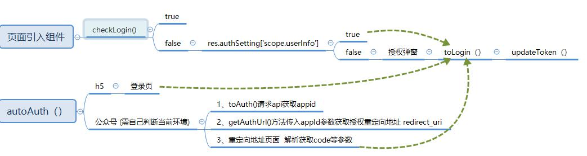

### 项目简述
* 授权需要后端配合，并非单单填入自己的appid本项目就能运行，授权之后返回的用户数据等需要相关api，因此如果要完整的运行，请前往gitee上下载完整项目，可参照对自己项目进行调整
* 本组件仅小程序、h5、微信公众号、头条小程序中有测试
* 版本一提交的太匆忙，部分细节被忽略,也没有详细的文档说明，这次补充
* 授权，鉴权涉及到全局，单一就一个组件，无法发挥多大作用，因此将整体流程完整包含，有涉及的将在简述中提及
* 项目中的整体授权，涉及环节较多，项目目录结构按照本人平常的代码习惯，觉得合适的可以在此基础上进行开发
* plugins目录中存放的是本人封装的request请求，在utils中的requset中初始化并使用该文件，你也可以单独引用该文件封装自己的request
* request方法对api请求前做一次鉴权判断，但这需要在请求传入参数时传入相关字段辅助（本人声明login为true时代表该api需要鉴权，未授权时，调用autoAuth（））

### 接入自己已有api测试请看这里
* manifest.json中填入自己appid
* /config.js下 更改 VUE_APP_URL 未自己请求地址
* /api/public,js 填写自己的接口地址  getWechatConfig(微信公众号配置)  / wechatAuth(微信公众号登录信息) / login(多端登录授权)
* common.js中的toLogin方法中在调用api方法login之后返回的信息中，根据自己api返回的字段名称替换token,expires_time字段即可，该方法中会自动调用updateToken更新store中的相关登录信息
* updateToken方法会调用getuserInfo去更新store中userinfo信息，可根据自己api进行调整或者注释即可

---

### 流程说明
* 小程序端用户未授权，引导用户手动授权，已授权将自动登录
* h5中未登录直接跳转至登录界面
* 微信公众号中未授权将直接公众号授权 （需要执行 npm install 安装 wechat-jssdk）

### 公众号授权流程 （已安装 wechat-jssdk）
* 相关方法存在在utils/auth.js中
* autoAuth() 方法中判断 _isWeixin = true时处于微信公众号环境下 （WECHAT_LOGIN 是在config.js下配置一个字段，为true时，将不会公众号授权，将走h5的登录界面）
* 执行utils/wechat/auth.js中 toAuth（）请求方法 获取appId等信息
* getAuthUrl()方法传入appId参数获取授权重定向地址 redirect_uri 
* 重定向地址页面  解析获取code等参数
* toLogin方法传入code参数等,该方法中 发起 wechatAuth(code)请求获取获取登录信息

---

### common部分方法说明
* autoAuth() 自动授权
* toLogin() 授权后去执行的登录相关
* updateToken() 更新 store中登录相关字段信息
* checkLogin() 判断当前是否登录状态

---

### 字段说明
|  字段   | 类型  |默认值  |描述  |
|  ----  | ----  |----  |----  |
| isAuto  | Boolean |true| 自动授权 true 用户已授权直接请求，未授权，弹窗引导用户

### V0.0.1
* common部分方法说明及流程说明

### V0.0.2
* 需要授权的界面引入x-arthorize组件，建议在main.js中全局声明，要使用的界面直接引入即可
* 调整isAuto与isHidden涉及逻辑
* 补充简述
* 补充怎么使用自己api测试
* 补充字段说明
* 补充流程图

### V0.0.3
* 补充公众号授权流程说明

### V0.0.4
* 小程序初始化时，增加鉴权，token过期时，直接移除授权相关信息
* 补充头条小程序字体文件

### V0.0.5
* 去除 isHidden，scopeUserInfo 字段，简化代码；
* store增加isLogin字段
* 其它平台登录后无法触发授权回调，借助store.getters.isLogin监听